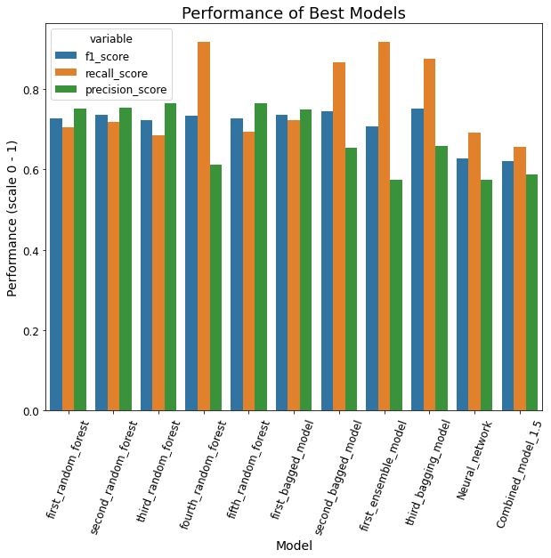

# Vowel Finder 

## Description
This was my final project at Flatiron Data Science Bootcamp. Here, **I aim to find all acoustic vowels in an unmarked audio file of natural conversational speech**. Uses cases for this project include:
- Start building an Automatic Speech Recognition system
- Identify languages (after segmenting and measuring component frequencies of the vowels used)
- Phonetic research (would greatly reduce human effort needed to segment vowels from speech)

The data originally came from a [study](http://groups.linguistics.northwestern.edu/speech_comm_group/wildcat/) done by Northwestern University Linguistics Department. The [transcriptions](https://speechbox.linguistics.northwestern.edu/wildcat/#!/recordings) were auto-aligned from transcriptions and hand corrected by the studies' authors. Unfortunately, the quality of the annotations were not sufficient, so I corrected one, 10-minute interview. The reason corrections were needed is that they were annotated at the _word_ level, and not the _acoustic_ level. For example, the first _e_ in "interesting" is often acoustically absent (there is a "chr" sound, not "ter"). In the original transcription the "e" sound will be marked, even if not actually present.

I investigate the effectiveness of four different approaches in this project: 
- **[Hampel Filter](https://dsp.stackexchange.com/questions/26552/what-is-a-hampel-filter-and-how-does-it-work)**: One finds the median volume of a small section of the audio file, and determines if the sample in question is above a threshold of standard deviations of that median volume. 
- **Neural Network**: Feeds the model frames of vowels and performs a 2D vanilla neural network to find vowels in the test data. The datapoints were the energy levels at each of the 13 MFCC bands.
- **Combination Model**: This model combines the results of the previous two models to hopefully obtain more accurate predicions.
- **Ensemble Learning Methods**: These methods [combine the decisions from multiple models to make predictions](https://towardsdatascience.com/simple-guide-for-ensemble-learning-methods-d87cc68705a2). I tested the effectiveness of multiple types of ensemble learning methods:
    1. _Bagging Methods_: These methods take random samples from the data, build a model for each sample, and combine the results into a single vote for that data point. Of these, I used sklearn.ensemble.RandomForestClassifier, sklearn.ensemble.BaggingClassifier, imblearn.ensemble.BalancedRandomForestClassifier, and imblearn.ensemble.BalancedBaggingClassifier.
    2. _Boosting Methods_: These methods sequentially build the model by running an algorithm on all the data and using the residuals of that algorithm to improve on each data point. In this project, I used imblearn.ensemble.EasyEnsembleClassifier.
The data fed to each of the ensemble methods included each of the energy levels at each of the 13 MFCC bands plus the percent of the samples that passed the Hampel Filter at a 200 ms sample rate. 

## Results
Overall, the Ensemble Learning Methods outperformed the neural networks/combination models and the Hampel Filter was the worst performing of the four general approaches tried. While the Hampel Filter provided data for the Ensemble Learning Methods and Combination Models, it didn't improve the Combination Models but involved much more computation (the difference in performance for the Ensemble Learning Methods wasn't tested). It's very clear that the Ensemble Learning Methods are the best performing option for this data. 

The best performing model was a balanced bagging model. It had an F1 Score of 0.751, having better recall than precision. In other words, it overpredicted vowels but found 87.5% of all the vowels present in the data. If one is concerned about only predicting vowels, then a random forest model is the best option, with a precision score of 76.4% (both the third and fifth random forest models had this score). 

The Neural Network model and Combination model both performed equally well. The Hampel Filter had a significantly lower effectiveness than the other two approaches. Since there is little if any gain from using a combination model, a 2D neural network is the best approach used here.

The results are presented in a [deck](https://docs.google.com/presentation/d/1E3h6cjbQvKEGE3kDF8XS36_IW0HKgu7hBuGMthUwPsc/edit?usp=sharing) that was presented as part of the Flatiron Bootcamp's Science Fair.

## Technologies Used
- Jupyter Notebook
- Python
    - Pandas
    - os
    - re
    - SciPy
    - NumPy
    - LibROSA 
    - Textgrids
    - numba
    - Seaborn
    - Matplotlib
    - Plotly
    - Keras
    - scikit-learn
    - imblearn

## Future Directions
This project was a first attempt at finding the most successful approach to finding a specific class of speech sounds acoustically. There are two areas of improvement: the phonetic side, and the data science side.

On the phonetic side, one could take more time to identify the main characteristics of vowels as compared to consonants. For example, vowels can carry pitch, so by measuring that aspect of a suspected vowel, we can be more sure we are correctly identifying vowels. Additionally, we could look at voicing, or more specifically, energy in the 50-100 Hz range, to better identify vowels.

On the data Science side, only a 2D neural network was found to have any significant result (many approaches had guessed the dominant class for all examples given). If we adjusted the type of neural network used and the parameters used with the neural network, we may have been more successful in finding vowels. 

In the future, I suggest using a neural network approach to finding vowels. While the Hampel Filter has the potential to perform very well with the correct sigma and filter window (the only two parameters it has), the time needed to find these parameters is likely much longer and requires more computation than to to use a neural network. 
